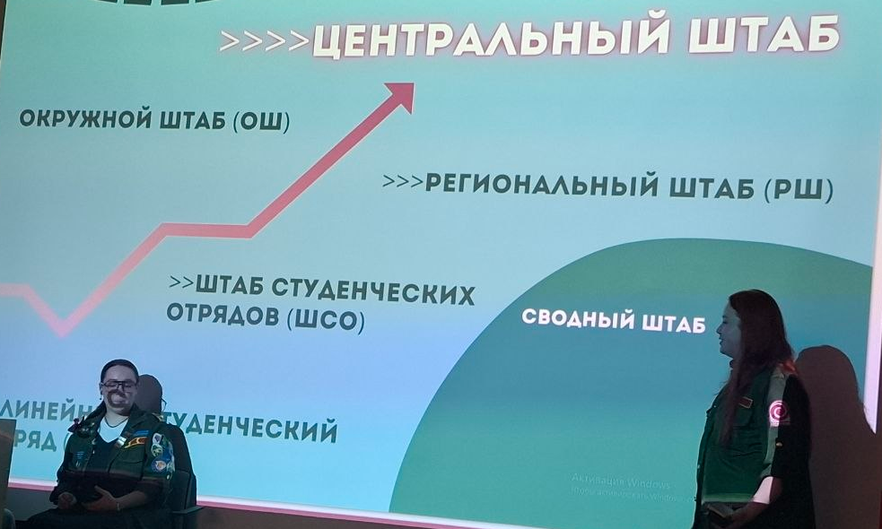
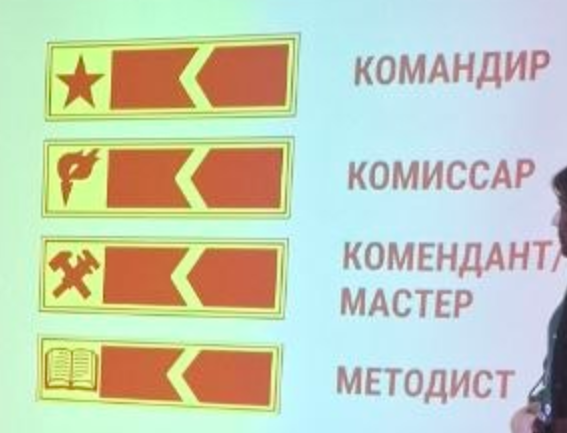

# Структура СПОСО

## Виды студенческих отрядов

- Студенческие **строительные** отряды
- Студенческие **педагогические** отряды
- Студенческие **археологические** отряды
- Студенческие **сельскохозяйственные** отряды
- Студенческие **отряды проводников**
- Студенческие **медицинские** отряды
- Студенческие **сервисные** отряды
- Студенческие **экологические** отряды

---

## Иерархия штабов

**Линейный студенческий отряд** → **Штаб студенческих отрядов (ШСО)** → **Региональный штаб (РШ)** → **Окружной штаб (ОШ)** → **Центральный штаб**

> Отдельно: **Сводный штаб**

---

## Командный состав

- Командир
- Комиссар
- Комендант / Мастер
- Методист

### Командир

Обеспечивает отряд работой, принимает важные для отряда решения, несёт ответственность за всё.

### Комиссар

Создаёт атмосферу в отряде, поддерживает членов, придумывает мероприятия для отряда, следит за выполнением традиций и создаёт новые.

### Методист

Отвечает за подготовку бойцов и кандидатов к работе в летних лагерях, несёт ответственность за методическую базу отряда.

### Комендант

Отвечает за материальную составляющую в отряде.

### Мастер

Организовывает и контролирует деятельность отряда.